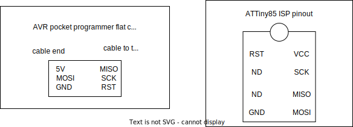
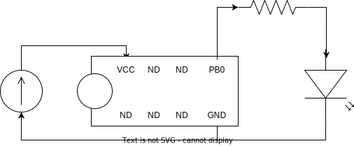

# Hello ATTiny85 with an AVR pocket programmer

Sample program and setup for testing the ATTiny85 and the AVR pocket programmer.

# Board wiring

The wiring for the programmer and for the LED can be overlapped.

`

`

# UDEV setup

In case you are using a GNU/Linux distro with udev, you need an udev rule to make the pocket programmer available to your user.

Copy the file _100-avr_pocket_programmer.rules_ in the folder _/etc/udev/rules.d_
and reload the udev rules.

# Building and running

```
$> make
$> make flash
```
